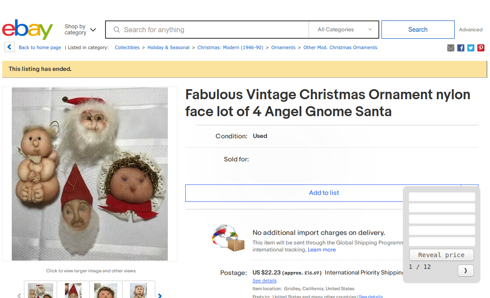
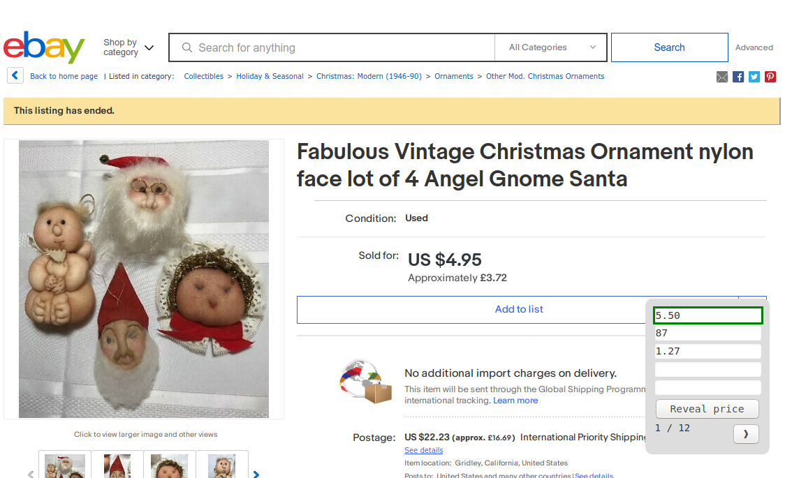

# Ebay Price is Right xmas quiz

## Firefox Greasemonkey script to run a fun price guessing quiz

The quiz is intended to be run remotely via screenshare, but could also be run in person with players gathered around the screen

### Installation (Firefox)
* Install Greasemonkey plugin (https://addons.mozilla.org/en-US/firefox/addon/greasemonkey/)
* Install this script into Greasemonkey, to run on the domain `ebay.co.uk`

### How it works
* The script checks if the current URL is part of the quiz
* If it is, the script injects some CSS
* The CSS simplifies the UI and hides the selling price
* The script also creates a panel in which players' guesses can be entered
* Once all the guesses are in a button can be pressed to reveal the answer & the winner
* The panel also provides navigation for the next (and previous) question

---

#### Panel to enter guesses, calculate the winner and navigate to next round

---

#### Answer revealed and winner highlighted

---

### How to run the quiz
* Open [the first link](https://www.ebay.co.uk/itm/Fabulous-Vintage-Christmas-Ornament-nylon-face-lot-of-4-Angel-Gnome-Santa-/264559622370?hash=item3d98fb78e2%3Ag%3ACqoAAOSwihtd4svs&LH_ItemCondition=4&nma=true&si=8LbPGEUJeG6IYX66F5Lz9jDjf4M%253D&orig_cvip=true&nordt=true&rt=nc&_trksid=p2047675.l2557) to start the quiz
* Players guess how much the item sold for (in GBP)
* Enter their guesses in the panel, then click the `Reveal Price` button
* The closest guess will be highlighted and the price revealed
* Click the right arrow to continue to the next round (there are 12)

### Make your own quiz!
Just replace the links with your own grotesque ebay finds!